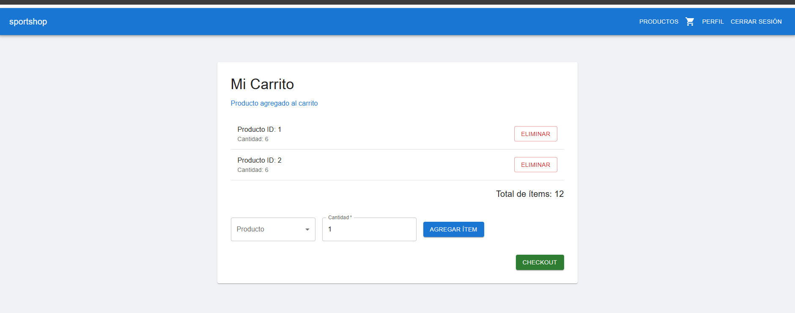
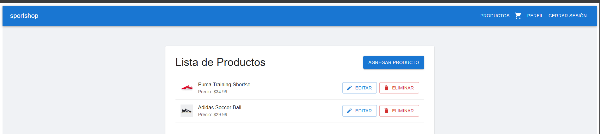
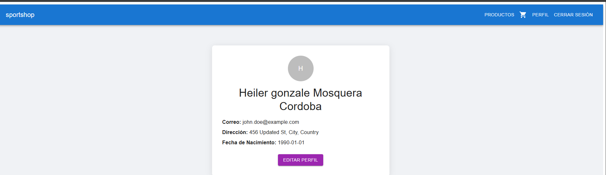

Resumen del Proyecto
El frontend de la aplicación de carrito de compras está construido con React y utiliza Material UI para la interfaz de usuario. Se conecta a un backend para gestionar productos, agregar artículos al carrito y realizar el proceso de compra. La aplicación está diseñada para ser modular, escalable y fácil de mantener.

Tecnologías Clave
React (v19.0.0): Biblioteca principal para construir la interfaz de usuario.

Material UI (v6.4.5): Proporciona componentes preconstruidos para una interfaz atractiva y accesible.

React Router Dom (v7.2.0): Gestiona las rutas de la aplicación.

Emotion (v11.14.0): Permite estilos CSS-in-JS para una mejor gestión de los estilos.

Testing Library (v16.2.0): Facilita las pruebas unitarias.

Requisitos
Node.js y npm deben estar instalados en la máquina.

Instalación
Clona el repositorio:

bash
Copy
git clone <https://github.com/JhonHeiler/CART-FRONTEND>
cd cart-frontend
Instala las dependencias:

bash
Copy
npm install
Ejecución del Proyecto
Para iniciar la aplicación en modo de desarrollo:

bash
Copy
npm start
La aplicación estará disponible en http://localhost:3000.

Estructura del Proyecto
public/: Contiene archivos estáticos como robots.txt y mono.png.

src/: Contiene los archivos fuente de la aplicación.

assets/: Archivos estáticos como imágenes e iconos.

components/: Componentes reutilizables.

auth/: Componentes relacionados con la autenticación.

products/: Componentes relacionados con productos.

layout/: Componentes de diseño como encabezados y pies de página.

profile/: Componentes de perfil de usuario.

context/: Proveedores de contexto, como AuthContext.jsx.

routes/: Rutas de la aplicación, como AppRoutes.jsx.

services/: Servicios para la comunicación con el backend.

authService.js, cartService.js, productService.js, userService.js.

App.js: Componente principal de la aplicación.

App.css: Estilos principales.

index.js: Punto de entrada de React.

Funcionalidades Principales
Visualizar productos: Los usuarios pueden ver una lista de productos disponibles.

Agregar productos al carrito: Los usuarios pueden añadir productos al carrito.

Ver detalles del carrito: Permite ver los productos seleccionados y sus cantidades.

Eliminar productos del carrito: Los usuarios pueden eliminar productos del carrito.

Pruebas
Para ejecutar las pruebas:

bash
Copy
npm test
Despliegue
Para crear una versión optimizada para producción:

bash
Copy
npm run build
Esto generará una carpeta build con la versión optimizada de la aplicación, lista para desplegar en un servidor o plataforma de hosting.

Conclusión
Este proyecto es un ejemplo de una aplicación moderna de carrito de compras, construida con tecnologías populares y bien estructurada. Es ideal para aprender o implementar funcionalidades avanzadas en aplicaciones React. ¡Buena suerte con tu desarrollo! 🚀